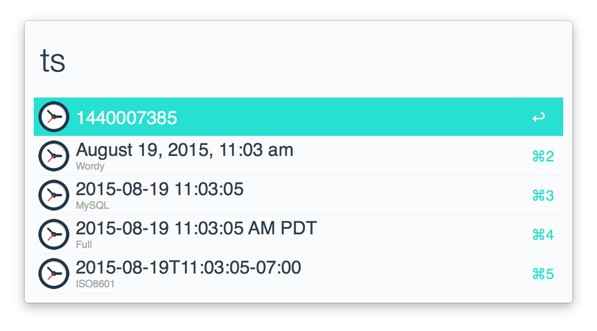

# ts alfred workflow

Alfred workflow to get or format timestamps

## Usage

`ts`: returns the current timestamp in various formats

`ts [DATETIME STRING]`: returns the given datetime string in various formats